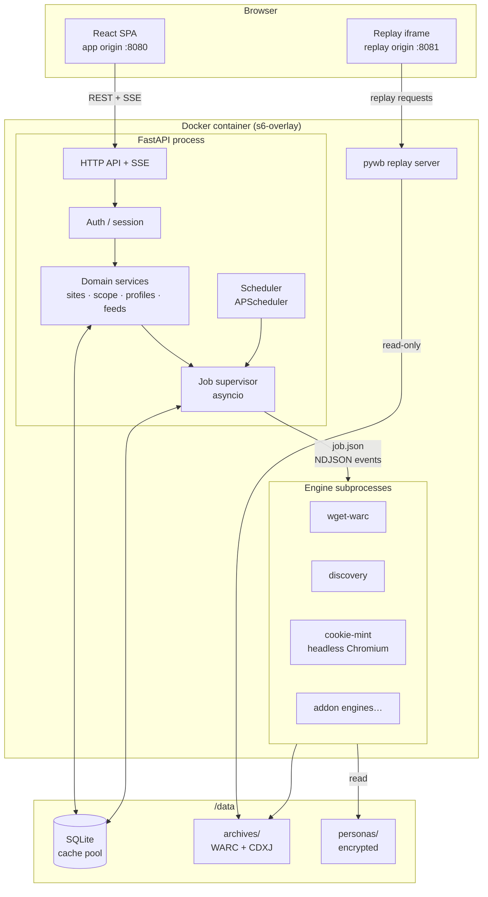
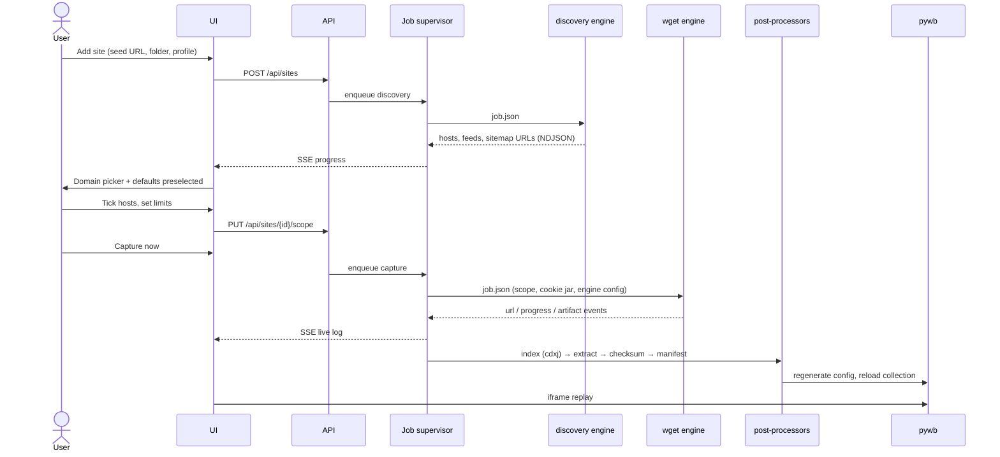

# 02 — Architecture

## System overview



Two origins reach the container. The app origin serves the SPA and the API; the replay origin serves nothing but archived content. They never share cookies. That separation is a security boundary, not a deployment convenience ([11](11-security.md#replay-is-untrusted-code-execution)).

---

## Components

### FastAPI process

One Python process holds the HTTP API, the job supervisor, and the scheduler. Nothing here is CPU-bound — capture work happens in subprocesses — so a single asyncio event loop is sufficient and avoids the coordination problems of a multi-worker deployment writing to one SQLite file.

**Layering.** Keep these strictly separated; the engine seam only pays off if the layers below it don't leak upward.

```
api/            FastAPI routers, request/response schemas, auth dependencies
services/       Business logic: sites, scope resolution, profiles, feeds, folders
jobs/           Supervisor, job lifecycle, event fan-out, cancellation
engines/        Engine registry, manifest loading, job-spec construction, protocol
storage/        Path resolution, atomic writes, symlink tree, checksums
db/             SQLAlchemy models, Alembic migrations, session management
crypto/         Secret sealing/unsealing
```

`services/` may not import `engines/` internals — it constructs an abstract capture request and hands it to `jobs/`. `engines/` may not import `services/` at all.

### Job supervisor

An asyncio task that owns the job lifecycle:

1. Poll the `jobs` table for `queued` rows, ordered by priority then age.
2. Respect a global concurrency cap and a per-host cap (never run two captures against the same host simultaneously — a self-inflicted DoS is the fastest way to get blocked).
3. Build a `job.json` spec and spawn the engine (`asyncio.create_subprocess_exec`, argv list, never `shell=True`).
4. Read the engine's stdout line by line as NDJSON. Persist `log` events to the capture's log file, `url` events in batches to the `capture_urls` table, `progress` events to the job row (throttled to ~1 Hz), and fan every event out to SSE subscribers.
5. On exit: run the post-processor chain — checksums, stats, the replay index, text extraction, the asset audit, the site thumbnail and any embedded media — write `manifest.json`, mark terminal state. The full list, its order and which steps are required is in [05](05-capture-engines.md#post-processors).
6. On cancellation: `SIGTERM`, grace period, `SIGKILL`. Partial WARCs are still indexed and kept — a partial archive beats no archive.

**Crash recovery.** On startup, any job in `running` is marked `interrupted` (the process that owned it is gone) with a resume offer. Engines should treat a resume as "re-crawl, dedup against the existing CDX," not "continue mid-stream."

### Engine subprocesses

Each capture, discovery run, or cookie mint is an isolated subprocess with a documented contract ([05](05-capture-engines.md)). Built-in engines are Python modules in the same image; addon engines can be either drop-in directories or Docker containers launched via the host socket (opt-in, off by default — mounting the Docker socket is a privilege escalation path and must be a conscious choice).

### pywb

Runs as a separate s6 service reading `/config/pywb/config.yaml`, regenerated by the app whenever collections change (site added, renamed, moved, capture completed). pywb gets **read-only** access to the archive tree. It has no database access and no knowledge of the app.

### Scheduler

APScheduler with a SQLite job store, driving: feed polls, sitemap diffs, recurring recaptures, index maintenance, symlink tree refresh, integrity verification, and retention pruning. It only ever *enqueues* jobs; it never executes capture work itself.

---

## Data flow: adding and capturing a site



The gap between discovery and capture is deliberate: nothing large gets written until a human has looked at the domain list and agreed to it.

---

## Technology choices

| Layer | Choice | Notes |
|---|---|---|
| Language | Python 3.12 | [D12](00-decisions.md#d12--python-backend) — the WARC ecosystem |
| Web framework | FastAPI + Uvicorn | Async, OpenAPI generation feeds the typed client |
| ORM / migrations | SQLAlchemy 2.0 + Alembic | Migrations from day one; retrofitting is painful |
| Database | SQLite (WAL) | [D5](00-decisions.md#d5--sqlite-not-postgres) |
| Scheduling | APScheduler | SQLAlchemy job store on the same DB |
| HTML parsing | `selectolax` (fallback `lxml`) | Fast; discovery parses a lot of pages |
| Feeds | `feedparser` | Handles Atom correctly — the ArchiveBox gap |
| Domain grouping | `tldextract` | Public Suffix List; `co.uk` must not group as `uk` |
| WARC | `warcio`, `cdxj-indexer` | Reading/indexing; wget does the writing |
| Replay | `pywb` | Sidecar |
| Browser (M5+) | Playwright + Chromium | Cookie minting, interactive profiles, browser engine |
| Crypto | `cryptography` (AES-GCM), `argon2-cffi` | Secrets and passwords |
| Frontend | React 18, Vite, TypeScript | [D13](00-decisions.md#d13--react-spa-not-server-rendered) |
| UI kit | Tailwind + shadcn/ui | Vendored components, no runtime dep |
| Data fetching | TanStack Query + generated OpenAPI client | Types flow from FastAPI schemas |
| Tables / tree | TanStack Table, dnd-kit | Domain picker and folder tree |
| Packaging | Docker, s6-overlay | [D14](00-decisions.md#d14--single-docker-image-multiple-processes) |

**Pinned versions belong in the repo, not here.** Note only that `pywb` and `wget` versions are load-bearing: pywb config format shifts between majors, and `--warc-dedup` behavior differs between wget 1.19 and 1.21+. Pin both in the Dockerfile and record the versions in each capture's `manifest.json`.

---

## Configuration

Three tiers, later overriding earlier:

1. **Defaults** in code.
2. **Environment variables** (`CAIRN_*`) — the Unraid template's surface. Deployment-level only: paths, ports, secret key, `PUID`/`PGID`, log level, concurrency cap.
3. **Database settings** — everything a user should be able to change without restarting the container. Edited in the UI.

The rule: if changing it requires a container restart, it's an env var; otherwise it's a DB setting. Nothing important lives only in a file the user has to SSH in to edit.

| Env var | Default | Purpose |
|---|---|---|
| `CAIRN_SECRET_KEY` | *(required)* | Master key for sealing secrets and signing sessions |
| `CAIRN_DATA_DIR` | `/data` | Archive root |
| `CAIRN_CONFIG_DIR` | `/config` | DB, engine drop-ins, pywb config |
| `CAIRN_PORT` | `8080` | App |
| `CAIRN_REPLAY_PORT` | `8081` | pywb |
| `CAIRN_REPLAY_PUBLIC_URL` | *(derived)* | External replay origin, for iframe `src` and CSP |
| `CAIRN_MAX_CONCURRENT_JOBS` | `2` | Global cap |
| `CAIRN_TRUSTED_PROXY` | *(unset)* | Enables `X-Forwarded-*` handling |
| `CAIRN_AUTH_HEADER_MODE` | `off` | Trusted-header auth for Authelia/Authentik |
| `PUID` / `PGID` / `UMASK` | `99` / `100` / `022` | Unraid conventions |

**`CAIRN_SECRET_KEY` has no default on purpose.** Generate one on first run, print it prominently in the logs with instructions to persist it, and refuse to start on subsequent runs if sealed secrets exist but the key is absent — silently rotating to a fresh key would render every stored cookie jar undecryptable with no error.

---

## Failure modes to design for

| Failure | Expected behavior |
|---|---|
| Engine crashes mid-crawl | Partial WARC is indexed and kept; job `failed` with the tail of stderr; resume offered |
| Container killed mid-crawl | Boot marks job `interrupted`; WARC truncated at the last complete record; indexer tolerates a trailing partial record |
| Disk fills | Pre-flight free-space check; abort cleanly at a configurable floor rather than corrupting; alert |
| Target rate-limits / 429s | Engine backs off exponentially; repeated 429 pauses the job rather than burning through retries |
| Cookie expired mid-crawl | Interstitial/login-page detection heuristic fires, job pauses, re-mint attempted, user notified if minting fails |
| pywb dies | App stays up; replay tab shows a clear degraded state, not a broken iframe |
| DB locked | `busy_timeout` + retry with backoff; long reads use a separate connection |
| Index corrupt/stale | Rebuild-index job; index is always derived data and safe to delete |
