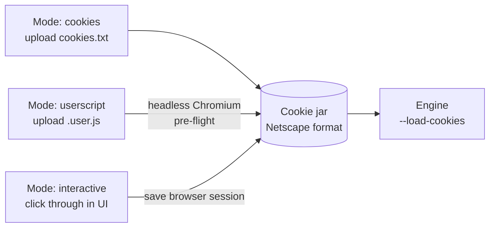
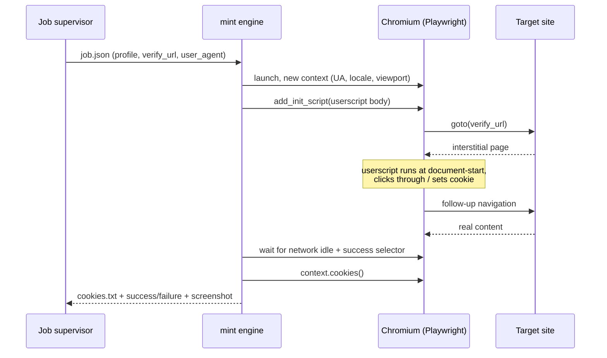

# 06 — Access Profiles: Cookies, Userscripts, and the Blogger Interstitial

Covers R4. An **access profile** is a named, reusable bundle of authentication material plus the user agent it was created with. Sites reference one; profiles are shared across sites.

---

## The constraint that shapes this whole design

**wget does not execute JavaScript.** A Tampermonkey userscript cannot run during a wget crawl — there is no DOM, no JS runtime, nothing for the script to attach to. Any design that treats "cookies or userscript" as two parallel inputs to the same crawler is broken from the start.

The resolution ([D4](00-decisions.md#d4--tampermonkey-userscripts-run-in-a-pre-flight-not-during-the-crawl)): **every mode produces a cookie jar.** The userscript mode runs the script once in headless Chromium as a pre-flight step, lets it dismiss the interstitial, then exports the resulting cookies and hands them to wget. The engine only ever sees `--load-cookies`.



This is what makes the per-site mode selector meaningful. Choosing `userscript` changes *how the credential is obtained*, not which crawler you're allowed to use.

---

## Mode 1 — `cookies`

Upload a Netscape-format `cookies.txt`, exported from your browser with any cookies.txt extension.

### Getting the export right

The two failure modes, both silent:

**Session cookies get dropped.** Interstitial cookies frequently have no expiry — they're session cookies. Many exporters omit them, and wget won't persist them without `--keep-session-cookies` (which the engine always passes). The UI should parse the upload and warn: *"No session cookies found. If the site's bypass uses a session cookie, re-export with 'include session cookies' enabled."*

**Domain scoping is wrong.** A cookie set on `www.blogger.com` is never sent to `foo.blogspot.com`. For Blogger you generally need cookies scoped to `.blogspot.com` (leading dot = all subdomains). The UI parses the jar, lists which hosts it actually covers, and cross-checks against the site's scope — flagging *"This profile covers `.google.com` but the site is `example.blogspot.com`; the cookies will not be sent."*

### Validation on upload

Parse and show, before saving:

| Check | Surfaced as |
|---|---|
| Valid Netscape format (7 tab-separated fields, `# Netscape HTTP Cookie File` header optional) | Hard error with the offending line number |
| Hosts covered | A chip list — the user can see at a glance whether the right domain is there |
| Session cookies present | Count, plus the warning above if zero |
| Earliest expiry | `expires_at`, drives proactive re-mint warnings |
| Obviously sensitive cookies (Google `SID`, `SSID`, `HSID`, `__Secure-*`) | *"This jar includes full Google account session cookies. Only the interstitial cookie is needed — consider exporting a narrower set."* |

That last check is worth building. Whole-browser cookie exports routinely include full account sessions, and a jar that can log into someone's Google account is a very different asset from one that dismisses a content warning.

---

## Mode 2 — `userscript`

Upload a `.user.js`. The pre-flight runs it and captures the result.

### The mint pipeline



### Implementation notes

**Injection point.** `context.add_init_script()` runs before any page script on every navigation and every frame — the closest equivalent to Tampermonkey's `@run-at document-start`. Scripts written for `document-idle` also work, since they typically wait on `DOMContentLoaded` themselves.

**Tampermonkey APIs.** Userscripts often use `GM_setValue`, `GM_getValue`, `GM_xmlhttpRequest`, `unsafeWindow`, `GM_addStyle`. A bare browser doesn't have them, so the mint engine prepends a small shim providing localStorage-backed `GM_*` storage, a `fetch`-backed `GM_xmlhttpRequest`, `unsafeWindow = window`, and a style-injecting `GM_addStyle`. Most interstitial-dismissal scripts use none of these, but a shim turns "fails cryptically" into "works." Parse the `==UserScript==` metadata block and warn about `@require`/`@resource`/`@grant` directives the shim doesn't cover, rather than failing silently.

**`@match` / `@include`.** Parse and check against the verify URL. If they don't match, the script would never have run in Tampermonkey either — say so, don't just report "no cookies produced."

**Success detection** — the profile's `verify_url` plus one of:
- a CSS selector that exists only on real content (`success_selector`)
- absence of a selector that exists only on the interstitial (`interstitial_selector`)
- a response-body regex that must *not* match
- default heuristic: final URL isn't a known interstitial path, response is 200, and body doesn't match the built-in content-warning patterns

**Artifacts.** The mint job saves a screenshot of the final state and a short trace. When a script fails, "here's what the browser actually saw" is the difference between a two-minute fix and an afternoon.

**Timeouts and safety.** Hard cap (default 60 s), one navigation chain, no downloads, no popups, no service workers. The userscript is user-supplied code running in your container — see [11](11-security.md#user-supplied-code).

### Re-minting

Minted jars expire. Re-mint when the earliest cookie expiry is within 24 h, when the jar is older than `profiles.mint_ttl_days` (default 7), when there is no jar yet, or when the user clicks **Run the script now**. All of it happens **before** the capture starts.

**The pause-and-resume design in earlier drafts of this document cannot be built.** It said: the engine emits `interstitial_detected`, the supervisor pauses the job, re-mints, and resumes with the fresh jar. wget reads `--load-cookies` once at startup and holds the jar in memory — there is no way to hand a running crawl a new one, and overwriting the file it was given changes nothing. Nothing about that is a limitation of the supervisor; it is what the flag means.

What replaces it is two checks either side of the crawl, which between them cover the same failure:

- **Before.** A jar that is expiring, stale, or missing is re-minted while re-minting is still free. That covers the case pause-and-resume was aimed at — a cookie that would have died two hours into a six-hour capture. A failed re-mint is a warning, not a refusal: the existing jar may still work, and blocking the capture would turn a possible problem into a certain one.
- **After.** The capture's own gap report counts how many archived pages look like a content warning rather than content, in the same WARC pass the asset audit already makes. If any do, it says so and the capture is downgraded from `ok` to `partial` — because a capture that reports success while containing 4,000 copies of an interstitial is precisely the failure this whole feature exists to prevent, and it must not be silent.

Only a **userscript** profile can be re-minted unattended. It is the only mode that still holds the thing that does the minting: a `cookies` profile has no way to produce a new jar, and an `interactive` one needs a person.

---

## Mode 3 — `interactive`

The strongest option, borrowed from Browsertrix's browser-profile workflow, which the original evaluation correctly identified as the most robust answer to the bypass problem.

Click **Open a browser and sign in** → a Chromium session starts in the container → you drive it from the page you already have open → you click through the interstitial or log in normally → click **Save this session as the profile** → cookies and localStorage are captured as a reusable profile.

**Why it beats both other modes:** it handles arbitrary login flows, multi-step consent, and anything requiring a human decision, with no script to write and no export extension to install. It's also the natural input for `browsertrix-crawler --profile` when that engine lands, so the same profile serves both the wget path (via exported cookies) and the browser path (via the stored `storage_state`).

### A CDP screencast, not noVNC

This document specified noVNC, which means Xvfb, a VNC server, websockify, and an X stack in the image. **None of that is needed.** Chromium streams the page itself over the DevTools protocol: `Page.startScreencast` emits JPEG frames, `Input.dispatchMouseEvent` and `Input.insertText` send events back, and it all works headless.

Measured at 1280×800, quality 60: **~8 KB a frame, ~75 KB/s** while something is actually moving. The app proxies it over one WebSocket — frames out as binary, input in as JSON.

Three things about that API are worth knowing, because each one produces a convincing-looking failure:

- **Frames are only emitted on visual change.** A settled page streams nothing at all, which is indistinguishable from a dead socket. The first attempt at this saw zero frames and nearly concluded screencast was unusable; the fix is that the server sends an explicit `idle` message and forces a frame when a client attaches.
- **Every frame must be acknowledged.** Without `Page.screencastFrameAck`, Chromium sends one frame and waits forever.
- **Typing goes through `Input.insertText`, not synthesised key events.** Getting the virtual key codes subtly wrong produces an empty password field with no error anywhere. Only keys that carry no text — Enter, Tab, the arrows — are dispatched as key events, from an explicit list.

### The WebSocket is its own security boundary

It inherits none of the API's protections and needs replacements for both:

- **The same-origin policy does not apply to WebSockets.** Any page on the internet can open one to `ws://your-nas:8080/…` and the browser will attach your session cookie. The handshake therefore checks `Origin` itself and refuses anything that is not this instance. What a hijacked socket would get is a live, driveable browser looking at whatever you are signed into — this is not a defacement-grade risk.
- **The CSRF header check cannot apply either**, since a handshake carries no custom headers. The origin check is what stands in for it.

`connect-src` names the socket's origin explicitly rather than relying on `'self'` to cover `ws:`. CSP3 says it does and current browsers agree, but the interactive pane is a canvas fed entirely by that socket — a browser that disagrees shows an empty box and explains itself only in the console, which is exactly how the replay tab failed in M3.

### What interactive mode cannot do: sign in to Google

Google refuses account sign-in from any browser it can tell is automated — the "this browser or app may not be secure" page. That is a deliberate anti-phishing measure on their side, aimed squarely at embedded and driven browsers, and it is maintained. **It is not a bug here and it is not worth trying to defeat**; anything that worked would be an arms race against a company that updates the detector, and the tool would break silently every time they did.

Two automation signals were removed, because they were gratuitous rather than inherent:

| Signal | Before | After |
|---|---|---|
| `navigator.webdriver` | `true` | `false` — Blink sets it from `--enable-automation`, which Playwright passes and this does not |
| User agent | `HeadlessChrome/151…` | `Chrome/151…`, read from the running browser and rewritten rather than hard-coded |

That helps with ordinary sites that treat a headless UA as a bot — where the thing being refused is a person at a keyboard whose window happens to be elsewhere. It does not help with Google, which looks at far more.

**Use the right mode for the job:**

- **A Blogger content warning needs no sign-in at all.** It is a button that sets a cookie. Interactive mode and a userscript both handle it, which is the case this feature was built for.
- **Content behind an actual Google account** — a private blog, an invite-only site — needs `cookies` mode: sign in with your own browser, export a `cookies.txt`, upload it. The sign-in happened in a real browser, so there is nothing to detect. This is the mode that was proven against a real flagged blog in M1, and it remains the answer whenever a login is genuinely involved.

Running headed under Xvfb was considered and rejected: it would remove the headless fingerprint natively, but the user agent override achieves the same visible result without adding an X server to the image, and neither approach changes the Google outcome.

**Costs:** Chromium in the image. Budgeted here at ~500 MB; measured at **1.25 GB** — 389 MB of browser, 169 MB of software GL (libllvm and mesa), and ~85 MB of CJK and emoji fonts. The fonts stay: without them a Japanese blog is tofu boxes in both the mint screenshot and the interactive browser. Installing with `--no-shell` avoids a second 262 MB copy of Chromium that nothing uses, which does mean launching with `channel="chromium"` — the default headless mode runs that shell and fails outright without it.

---

## The Blogger interstitial specifically

Blogger shows a content warning on blogs flagged as adult: an interstitial page with a "I understand and wish to continue" control. Continuing sets a cookie; subsequent requests carrying that cookie get real content.

**Don't hard-code a cookie name.** The exact name, domain, and path have changed over time and vary by locale and blog configuration. The tool should carry the whole jar and let the site decide what it needs.

### Discovering what your blog actually needs

1. Open the blog in a normal browser with DevTools → Network, preserve log on.
2. Click through the warning.
3. Find the response that carries `Set-Cookie`. Note the **name, domain, path, and expiry** — in particular whether the domain has a leading dot (all blogspot subdomains) or is host-specific (that blog only).
4. Note the **User-Agent** that made the request. Put the same one on the profile.
5. Export cookies with session cookies included.

Record steps 3 and 4 in the profile's notes field. When it breaks in eight months, that note is what makes it fixable.

### Practical notes

- **One profile can cover many blogs.** If the cookie is scoped to `.blogspot.com`, a single `blogger-interstitial` profile works for every flagged blogspot site you archive. Set `hosts: ["*.blogspot.com"]` on the profile so the UI suggests it automatically for new blogspot sites.
- **Match the user agent.** Some interstitial implementations bind the cookie loosely to the client. Mismatched UAs are a common cause of "it worked in my browser but not in the crawl."
- **Custom domains still hit blogspot.** A Blogger blog on `example.com` still serves images from `*.bp.blogspot.com` and may redirect through blogspot for the interstitial. Include both in the profile's host list.
- **Verify before crawling.** The profile's **Test** button fetches `verify_url` with the jar and reports whether it got real content or the interstitial. Always run this before a multi-hour capture.

---

## Storage and API surface

Profiles live in `access_profiles` ([03](03-data-model-and-storage.md#access-profiles)) with material sealed via AES-GCM under a key derived from `CAIRN_SECRET_KEY`. The plaintext cookie jar is materialized only into the job's `temp_dir`, `chmod 600`, and deleted when the job ends — including on crash, via an on-boot sweep of `/data/tmp`.

**The API never returns secret material.** `GET /api/profiles/{id}` returns:

```json
{
  "id": 3,
  "name": "blogger-interstitial",
  "mode": "userscript",
  "hosts": ["*.blogspot.com"],
  "user_agent": "Mozilla/5.0 …",
  "cookie_count": 4,
  "session_cookie_count": 2,
  "hosts_covered": [".blogspot.com", "www.blogger.com"],
  "minted_at": "2026-08-09T09:12:00Z",
  "expires_at": "2026-08-16T09:12:00Z",
  "fingerprint": "sha256:1f3a…",
  "last_verified_at": "2026-08-09T09:12:04Z",
  "last_verify_result": "ok"
}
```

`fingerprint` lets the UI show "the jar changed" without ever transmitting it. Write-only fields render as "•••••• (set)" with **Replace** and **Clear** actions.

---

## UI flow

**Settings → Access Profiles**

```
┌─ Access Profiles ─────────────────────────────────────── [+ New] ─┐
│                                                                   │
│  ● blogger-interstitial            userscript      4 cookies      │
│    *.blogspot.com                  ⚠ expires in 6 days            │
│    Last verified 3 min ago ✓                  [Test] [Re-mint] [⋯]│
│                                                                   │
│  ● wordpress-login                 cookies         11 cookies     │
│    example.com                     expires 2027-01-14             │
│    Last verified 4 days ago ✓                       [Test]    [⋯] │
└───────────────────────────────────────────────────────────────────┘
```

**Site editor → Access**

```
Access profile   [ blogger-interstitial            ▾ ]  [Test with this site]
                 ✓ Covers example.blogspot.com
                 ⚠ Does not cover 1.bp.blogspot.com (assets may fail)
```

That inline coverage check against the site's actual scope is the single highest-value piece of UI in this area. It converts the most common failure — a jar that doesn't cover the hosts being crawled — from a silent six-hour waste into a warning before you start.
