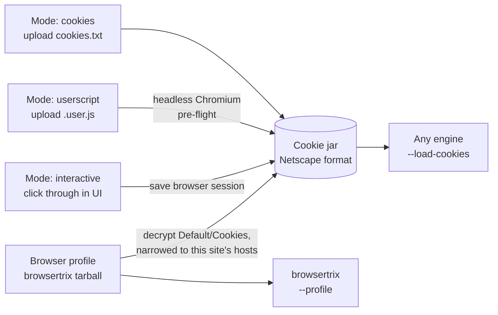
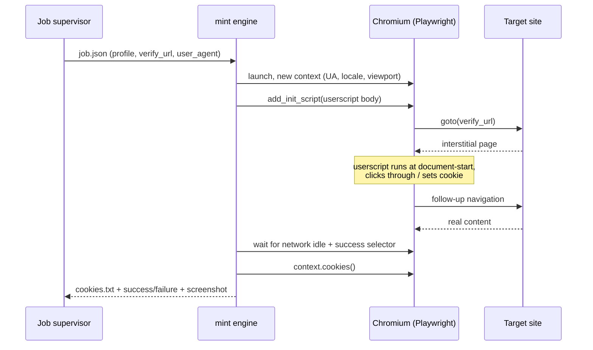

# 06 — Access Profiles: Cookies, Userscripts, and the Blogger Interstitial

Covers R4. An **access profile** is a named, reusable bundle of authentication material plus the user agent it was created with. Sites reference one; profiles are shared across sites.

---

## The constraint that shapes this whole design

**wget does not execute JavaScript.** A Tampermonkey userscript cannot run during a wget crawl — there is no DOM, no JS runtime, nothing for the script to attach to. Any design that treats "cookies or userscript" as two parallel inputs to the same crawler is broken from the start.

The resolution ([D4](00-decisions.md#d4--tampermonkey-userscripts-run-in-a-pre-flight-not-during-the-crawl)): **every mode produces a cookie jar.** The userscript mode runs the script once in headless Chromium as a pre-flight step, lets it dismiss the interstitial, then exports the resulting cookies and hands them to wget. The engine only ever sees `--load-cookies`.



This is what makes the per-site mode selector meaningful. Choosing `userscript` changes *how the credential is obtained*, not which crawler you're allowed to use.

**The browser profile broke that for a while, and the fourth arrow is the repair.** browsertrix takes `--profile <tar.gz>` and has no cookie option at all, so the profile was the one producer with no jar — and attaching one silently also chose the engine, which is precisely the coupling [D4](00-decisions.md#d4--tampermonkey-userscripts-run-in-a-pre-flight-not-during-the-crawl) rejected. It went unnoticed because it looks like an engine capability rather than a UI coupling. Cairn now reads the tarball's `Default/Cookies` and derives a jar, so a profile minted by signing in works on every engine.

**The asymmetry is real and worth saying out loud rather than hiding.** A tarball can produce a jar; a jar cannot produce a tarball. So:

| You have | wget | browsertrix |
|---|---|---|
| `cookies.txt`, userscript, or interactive | yes | **no** |
| browser profile | yes, derived | yes, native |

Which makes the browser profile the mode to prefer whenever either would do — it is the only one that constrains nothing. An uploaded jar still wins over a derived one when a profile holds both: it is what somebody chose for this site, and it may be deliberately narrower than the browser's whole cookie store.

---

## Mode 1 — `cookies`

Upload a Netscape-format `cookies.txt`, exported from your browser with any cookies.txt extension.

### Getting the export right

The two failure modes, both silent:

**Session cookies get dropped.** Interstitial cookies frequently have no expiry — they're session cookies. Many exporters omit them, and wget won't persist them without `--keep-session-cookies` (which the engine always passes). The UI should parse the upload and warn: *"No session cookies found. If the site's bypass uses a session cookie, re-export with 'include session cookies' enabled."*

**Domain scoping is wrong.** A cookie set on `www.blogger.com` is never sent to `foo.blogspot.com`. For Blogger you generally need cookies scoped to `.blogspot.com` (leading dot = all subdomains). The UI parses the jar, lists which hosts it actually covers, and cross-checks against the site's scope — flagging *"This profile covers `.google.com` but the site is `example.blogspot.com`; the cookies will not be sent."*

### Validation on upload

Parse and show, before saving:

| Check | Surfaced as |
|---|---|
| Valid Netscape format (7 tab-separated fields, `# Netscape HTTP Cookie File` header optional) | Hard error with the offending line number |
| Hosts covered | A chip list — the user can see at a glance whether the right domain is there |
| Session cookies present | Count, plus the warning above if zero |
| Earliest expiry | `expires_at`, drives proactive re-mint warnings |
| Obviously sensitive cookies (Google `SID`, `SSID`, `HSID`, `__Secure-*`) | *"This jar includes full Google account session cookies. Only the interstitial cookie is needed — consider exporting a narrower set."* |

That last check is worth building. Whole-browser cookie exports routinely include full account sessions, and a jar that can log into someone's Google account is a very different asset from one that dismisses a content warning.

---

## Mode 2 — `userscript`

Upload a `.user.js`. The pre-flight runs it and captures the result.

### The mint pipeline



### Implementation notes

**Injection point.** `context.add_init_script()` runs before any page script on every navigation and every frame — the closest equivalent to Tampermonkey's `@run-at document-start`. Scripts written for `document-idle` also work, since they typically wait on `DOMContentLoaded` themselves.

**Tampermonkey APIs.** Userscripts often use `GM_setValue`, `GM_getValue`, `GM_xmlhttpRequest`, `unsafeWindow`, `GM_addStyle`. A bare browser doesn't have them, so the mint engine prepends a small shim providing localStorage-backed `GM_*` storage, a `fetch`-backed `GM_xmlhttpRequest`, `unsafeWindow = window`, and a style-injecting `GM_addStyle`. Most interstitial-dismissal scripts use none of these, but a shim turns "fails cryptically" into "works." Parse the `==UserScript==` metadata block and warn about `@require`/`@resource`/`@grant` directives the shim doesn't cover, rather than failing silently.

**`@match` / `@include`.** Parse and check against the verify URL. If they don't match, the script would never have run in Tampermonkey either — say so, don't just report "no cookies produced."

**Success detection** — the profile's `verify_url` plus one of:
- a CSS selector that exists only on real content (`success_selector`)
- absence of a selector that exists only on the interstitial (`interstitial_selector`)
- a response-body regex that must *not* match
- default heuristic: final URL isn't a known interstitial path, response is 200, and body doesn't match the built-in content-warning patterns

**Artifacts.** The mint job saves a screenshot of the final state and a short trace. When a script fails, "here's what the browser actually saw" is the difference between a two-minute fix and an afternoon.

**Timeouts and safety.** Hard cap (default 60 s), one navigation chain, no downloads, no popups, no service workers. The userscript is user-supplied code running in your container — see [11](11-security.md#user-supplied-code).

### Re-minting

Minted jars expire. Re-mint when the earliest cookie expiry is within 24 h, when the jar is older than `profiles.mint_ttl_days` (default 7), when there is no jar yet, or when the user clicks **Run the script now**. All of it happens **before** the capture starts.

**A gate usually redirects rather than serving a warning.** Detection was written around inspecting the body of a 200 — and Blogger, for one, answers the seed with a **302** to `www.blogger.com/interstitial/blog?u=<blog>`, on a host no site's scope covers. wget records the redirect, follows nothing, and stops. So the archive holds one record, the capture used to report `partial` with no explanation at all, and the first sign of trouble was pywb inside the replay iframe reporting that a URL nobody had entered was missing from the collection. Redirect targets are now checked against the same interstitial markers as page bodies, `/interstitial/` among them, and a capture that ends at one says so and names both ends.

**The pause-and-resume design in earlier drafts of this document cannot be built.** It said: the engine emits `interstitial_detected`, the supervisor pauses the job, re-mints, and resumes with the fresh jar. wget reads `--load-cookies` once at startup and holds the jar in memory — there is no way to hand a running crawl a new one, and overwriting the file it was given changes nothing. Nothing about that is a limitation of the supervisor; it is what the flag means.

What replaces it is two checks either side of the crawl, which between them cover the same failure:

- **Before.** A jar that is expiring, stale, or missing is re-minted while re-minting is still free. That covers the case pause-and-resume was aimed at — a cookie that would have died two hours into a six-hour capture. A failed re-mint is a warning, not a refusal: the existing jar may still work, and blocking the capture would turn a possible problem into a certain one.
- **After.** The capture's own gap report counts how many archived pages look like a content warning rather than content, in the same WARC pass the asset audit already makes. If any do, it says so and the capture is downgraded from `ok` to `partial` — because a capture that reports success while containing 4,000 copies of an interstitial is precisely the failure this whole feature exists to prevent, and it must not be silent.

  The count is **two disjoint numbers**, `interstitial_pages` and `overlay_pages`, because they carry opposite advice. A gate *instead of* the page means the content never arrived and the profile is what to fix. A gate *over* the page ([above](#it-is-no-longer-a-separate-page--it-is-drawn-over-the-real-one)) means it arrived in full — so that warning says the content is present and never mentions re-minting, which would send somebody to work on the one thing already proven to be fine.

  **Only the first downgrades the capture unconditionally.** An overlay does so only when [replay is not uncovering it](07-replay.md#uncovering-a-page-the-site-drew-a-warning-over), because with uncovering on there is nothing wrong: every page is present and every page displays. This was shipped the other way for one commit, and the report that came back was "pages are now rendered, capture still says Partial." `partial` is not cosmetic — it fires `INTERSTITIAL_DETECTED` and counts in the digest, so on a blog captured to a schedule it would have said "capture incomplete" once per run, forever. A warning that is always wrong is how the next real one gets ignored. The count and the warning stay either way: the rendering differs from the archived bytes, and that has to be sayable without being alarming.

  **A third number, `gate_documents`, counts the gate itself.** An overlay *frames* the gate, so the crawler records it once per curtained page at the gate's own URL — 147 of them on a capture whose every one of 147 pages was complete. Counted as interstitial pages, as they were at first, those said "the cookies were not accepted" and downgraded the capture unconditionally, which is how "pages are rendered, capture still says Partial" happened a second time. A gate served at *the site's own URL* is still the failure it always was; a gate served at the gate's URL is not a page of this site at all, and its sub-resources are not this site's missing assets either.

  **Every downgrade records why**, in `stats.partial_reasons`, because that episode exposed a gap with a longer reach than one wrong label: a rule can stop being true, and a manifest that says *that* a capture was partial and never *why* leaves the verdict unrevisitable except by crawling the site again. **Recheck partial captures** (`POST /api/maintenance/recompute-status`, or `cairn recompute-status`) re-decides from those records. It only ever promotes `partial` to `ok`, and it reports a line per capture either way, including the refusals and why.

  **A stored count goes stale exactly as a stored rule does**, which the `gate_documents` split proved: manifests written before it record 147 "interstitial pages" that are now 0. So reasons a WARC can answer — the interstitial and overlay counts — are **recounted from the capture's own bytes** rather than read off the manifest. Reasons a WARC cannot answer (a redirect chain, an empty crawl, a step that raised) are believed as recorded, as is a job that reported an error. A capture whose WARCs cannot be read is refused: "I cannot tell" must not resolve to "nothing was wrong". Recounting is bounded to captures whose reasons are recountable at all, and there is a negative-control test that a capture genuinely full of warnings survives it.

Only a **userscript** profile can be re-minted unattended. It is the only mode that still holds the thing that does the minting: a `cookies` profile has no way to produce a new jar, and an `interactive` one needs a person.

---

## Mode 3 — `interactive`

The strongest option, borrowed from Browsertrix's browser-profile workflow, which the original evaluation correctly identified as the most robust answer to the bypass problem.

Click **Open a browser and sign in** → a Chromium session starts in the container → you drive it from the page you already have open → you click through the interstitial or log in normally → click **Save this session as the profile** → cookies and localStorage are captured as a reusable profile.

**Why it beats both other modes:** it handles arbitrary login flows, multi-step consent, and anything requiring a human decision, with no script to write and no export extension to install. It's also the natural input for `browsertrix-crawler --profile` when that engine lands, so the same profile serves both the wget path (via exported cookies) and the browser path (via the stored `storage_state`).

### A CDP screencast, not noVNC

This document specified noVNC, which means Xvfb, a VNC server, websockify, and an X stack in the image. **None of that is needed.** Chromium streams the page itself over the DevTools protocol: `Page.startScreencast` emits JPEG frames, `Input.dispatchMouseEvent` and `Input.insertText` send events back, and it all works headless.

Measured at 1280×800, quality 60: **~8 KB a frame, ~75 KB/s** while something is actually moving. The app proxies it over one WebSocket — frames out as binary, input in as JSON.

Three things about that API are worth knowing, because each one produces a convincing-looking failure:

- **Frames are only emitted on visual change.** A settled page streams nothing at all, which is indistinguishable from a dead socket. The first attempt at this saw zero frames and nearly concluded screencast was unusable; the fix is that the server sends an explicit `idle` message and forces a frame when a client attaches.
- **Every frame must be acknowledged.** Without `Page.screencastFrameAck`, Chromium sends one frame and waits forever.
- **Typing goes through `Input.insertText`, not synthesised key events.** Getting the virtual key codes subtly wrong produces an empty password field with no error anywhere. Only keys that carry no text — Enter, Tab, the arrows — are dispatched as key events, from an explicit list.

### The WebSocket is its own security boundary

It inherits none of the API's protections and needs replacements for both:

- **The same-origin policy does not apply to WebSockets.** Any page on the internet can open one to `ws://your-nas:8080/…` and the browser will attach your session cookie. The handshake therefore checks `Origin` itself and refuses anything that is not this instance. What a hijacked socket would get is a live, driveable browser looking at whatever you are signed into — this is not a defacement-grade risk.
- **The CSRF header check cannot apply either**, since a handshake carries no custom headers. The origin check is what stands in for it.

`connect-src` names the socket's origin explicitly rather than relying on `'self'` to cover `ws:`. CSP3 says it does and current browsers agree, but the interactive pane is a canvas fed entirely by that socket — a browser that disagrees shows an empty box and explains itself only in the console, which is exactly how the replay tab failed in M3.

### What interactive mode cannot do: sign in to Google

Google refuses account sign-in from any browser it can tell is automated — the "this browser or app may not be secure" page. That is a deliberate anti-phishing measure on their side, aimed squarely at embedded and driven browsers, and it is maintained. **It is not a bug here and it is not worth trying to defeat**; anything that worked would be an arms race against a company that updates the detector, and the tool would break silently every time they did.

Two automation signals were removed, because they were gratuitous rather than inherent:

| Signal | Before | After |
|---|---|---|
| `navigator.webdriver` | `true` | `false` — Blink sets it from `--enable-automation`, which Playwright passes and this does not |
| User agent | `HeadlessChrome/151…` | `Chrome/151…`, read from the running browser and rewritten rather than hard-coded |

That helps with ordinary sites that treat a headless UA as a bot — where the thing being refused is a person at a keyboard whose window happens to be elsewhere. It does not help with Google, which looks at far more.

**Use the right mode for the job:**

- **A Blogger content warning needs no sign-in at all.** It is a button that sets a cookie. Interactive mode and a userscript both handle it, which is the case this feature was built for.
- **Content behind an actual Google account** — a private blog, an invite-only site — needs `cookies` mode: sign in with your own browser, export a `cookies.txt`, upload it. The sign-in happened in a real browser, so there is nothing to detect. This is the mode that was proven against a real flagged blog in M1, and it remains the answer whenever a login is genuinely involved.

Running headed under Xvfb was considered and rejected: it would remove the headless fingerprint natively, but the user agent override achieves the same visible result without adding an X server to the image, and neither approach changes the Google outcome.

**Costs:** Chromium in the image. Budgeted here at ~500 MB; measured at **1.25 GB** — 389 MB of browser, 169 MB of software GL (libllvm and mesa), and ~85 MB of CJK and emoji fonts. The fonts stay: without them a Japanese blog is tofu boxes in both the mint screenshot and the interactive browser. Installing with `--no-shell` avoids a second 262 MB copy of Chromium that nothing uses, which does mean launching with `channel="chromium"` — the default headless mode runs that shell and fails outright without it.

---

## The Blogger interstitial specifically

Blogger shows a content warning on blogs flagged as adult: an interstitial page with a "I understand and wish to continue" control. Continuing sets a cookie; subsequent requests carrying that cookie get real content.

**Don't hard-code a cookie name.** The exact name, domain, and path have changed over time and vary by locale and blog configuration. The tool should carry the whole jar and let the site decide what it needs.

### It is no longer a separate page — it is drawn over the real one

Measured on a live gated blog, 2026-08-16 (`scripts/probes/overlay_probe.py`). Blogger does **not** redirect to the warning any more, and does not serve it in place of the post. It answers `200` with the complete post — title, body, images, every asset — and injects an overlay into that same HTML:

```html
<body class='loading'><iframe id="injected-iframe"
   src="https://www.blogger.com/interstitial/blog?u=https://blog.example.com/p.html"
   style="position:absolute; z-index:999; visibility:visible"></iframe>
<style>body { _height: 100%; } body * { visibility: hidden; }</style>
```

The gate's own response proves the design: it carries `content-security-policy: frame-ancestors https://<the blog>`, so it is *meant* to be framed by the blog.

Three consequences, each of which cost a round to learn:

- **Nothing is missing, and the profile is not broken.** 442 of 442 archived posts carried the overlay and every one was complete underneath. The cookies worked — that is precisely how a full page arrived to be drawn over. The page's own config says `'interstitialAccepted': false`, which is **per-browser state, not authentication**.
- **Crawl-scope rejects cannot stop it.** `--exclude` filters the queue, and `--blockRules` exempts page navigation — which a frame document is. Rejecting `/interstitial/` cut each page from ~500 KB to ~80 KB by starving the frame of sub-resources, and never stopped the frame itself.
- **Withholding it from the replay index does not reveal the post.** The `<iframe>` and the hiding rule are in the archived bytes. Take the gate out of the index and the same box shows pywb's "could not be found in this collection" instead. That is the overlay working as designed, not a second bug.

**Re-accepting the warning is not a dependable fix, and this is the part worth knowing before spending a capture on it.** Measured across three captures of the same blog (`scripts/probes/README.md`): the `INTERSTITIAL` cookie was present and sent throughout — one 63-char value, identical across every capture and every site, on 499 of 500 requests — and so were the User-Agent and every `Sec-Ch-Ua`/`Sec-Fetch` header. The same 70 posts came back **clean at 03:27 and curtained at 13:57 the same day**, with nothing changed at either end. Within the earlier capture it was already inconsistent: all 70 posts clean while 254 `/search` pages were curtained at the same moment.

That rules out profile expiry, a mismatched user agent, and sign-in state — no Google auth cookie is sent to the blog at all, and none is needed, since this is a content warning rather than a login. The server simply stops honouring its own token, on its own schedule.

**What held in every run is that the content came back complete** — 442 of 442 posts, curtain or no curtain. So the loss is presentational and it lives in the archived bytes, which puts the only reliable fix at replay rather than at capture. Accepting the warning again is worth one try, because it is free; it is not worth building a workflow around.

**Both older checks were blind to this by construction**, which is why a capture full of it reported `ready`. `url_looks_blocked` sees the blog's own URL; the phrase list never runs because a 70–100 KB post is far past `MAX_INTERSTITIAL_BYTES`. `interstitial.overlay_blocked` now covers it, requiring *both* an interstitial-framed iframe and a rule hiding the body — structural signals, so an article that merely writes *about* content warnings is not flagged. It runs at any length, and it feeds the profile Test button as well as the capture scan.

### Discovering what your blog actually needs

1. Open the blog in a normal browser with DevTools → Network, preserve log on.
2. Click through the warning.
3. Find the response that carries `Set-Cookie`. Note the **name, domain, path, and expiry** — in particular whether the domain has a leading dot (all blogspot subdomains) or is host-specific (that blog only).
4. Note the **User-Agent** that made the request. Put the same one on the profile.
5. Export cookies with session cookies included.

Record steps 3 and 4 in the profile's notes field. When it breaks in eight months, that note is what makes it fixable.

### Practical notes

- **One profile can cover many blogs.** If the cookie is scoped to `.blogspot.com`, a single `blogger-interstitial` profile works for every flagged blogspot site you archive. Set `hosts: ["*.blogspot.com"]` on the profile so the UI suggests it automatically for new blogspot sites.
- **Match the user agent.** Some interstitial implementations bind the cookie loosely to the client. Mismatched UAs are a common cause of "it worked in my browser but not in the crawl."
- **Custom domains still hit blogspot.** A Blogger blog on `example.com` still serves images from `*.bp.blogspot.com` and may redirect through blogspot for the interstitial. Include both in the profile's host list.
- **Verify before crawling.** The profile's **Test** button fetches `verify_url` with the jar and reports whether it got real content or the interstitial. Always run this before a multi-hour capture. **Test in the crawler** does the same through browsertrix with the browser profile, which is the only one that can answer for a browser profile — and since both now run `overlay_blocked`, either will catch a page that is complete but curtained off. Before that they reported "real content" on exactly those pages, truthfully and uselessly.

---

## Storage and API surface

Profiles live in `access_profiles` ([03](03-data-model-and-storage.md#access-profiles)) with material sealed via AES-GCM under a key derived from `CAIRN_SECRET_KEY`. The plaintext cookie jar is materialized only into the job's `temp_dir`, `chmod 600`, and deleted when the job ends — including on crash, via an on-boot sweep of `/data/tmp`.

**The API never returns secret material.** `GET /api/profiles/{id}` returns:

```json
{
  "id": 3,
  "name": "blogger-interstitial",
  "mode": "userscript",
  "hosts": ["*.blogspot.com"],
  "user_agent": "Mozilla/5.0 …",
  "cookie_count": 4,
  "session_cookie_count": 2,
  "hosts_covered": [".blogspot.com", "www.blogger.com"],
  "minted_at": "2026-08-09T09:12:00Z",
  "expires_at": "2026-08-16T09:12:00Z",
  "fingerprint": "sha256:1f3a…",
  "last_verified_at": "2026-08-09T09:12:04Z",
  "last_verify_result": "ok"
}
```

`fingerprint` lets the UI show "the jar changed" without ever transmitting it. Write-only fields render as "•••••• (set)" with **Replace** and **Clear** actions.

---

## UI flow

**Settings → Access Profiles**

```
┌─ Access Profiles ─────────────────────────────────────── [+ New] ─┐
│                                                                   │
│  ● blogger-interstitial            userscript      4 cookies      │
│    *.blogspot.com                  ⚠ expires in 6 days            │
│    Last verified 3 min ago ✓                  [Test] [Re-mint] [⋯]│
│                                                                   │
│  ● wordpress-login                 cookies         11 cookies     │
│    example.com                     expires 2027-01-14             │
│    Last verified 4 days ago ✓                       [Test]    [⋯] │
└───────────────────────────────────────────────────────────────────┘
```

**Site editor → Access**

```
Access profile   [ blogger-interstitial            ▾ ]  [Test with this site]
                 ✓ Covers example.blogspot.com
                 ⚠ Does not cover 1.bp.blogspot.com (assets may fail)
```

That inline coverage check against the site's actual scope is the single highest-value piece of UI in this area. It converts the most common failure — a jar that doesn't cover the hosts being crawled — from a silent six-hour waste into a warning before you start.

---

## Beyond the cookie jar

A profile has always carried a user agent alongside its cookies. Interactive
mode has, since M5, also saved Playwright's full `storage_state` — cookies plus
localStorage per origin — and the userscript mint now saves it too, so a
re-mint no longer quietly downgrades a profile every time it refreshes itself.

**What can use it, and what cannot.** Every browser path in this application
does: the re-mint, the profile test, browser-based discovery. wget does not,
and cannot: it takes `--load-cookies` and there is nothing else to hand it.

That gap is invisible without being told, and it produces the most confusing
possible symptom — *the profile test passes and the capture gets the sign-in
page* — so the profile page says it outright when a profile holds localStorage
items:

> This profile also holds 12 localStorage item(s) from 2 origin(s). The browser
> engines and the profile test use them; the wget engine cannot.

Counts and origins only. A key name is as much a secret as its value, and
docs/06's rule that a profile never serializes its material does not have an
exception for the interesting half of it.

**docs/13 hoped this would also make a profile work with
`browsertrix-crawler --profile`. It does not.** M7 measured why: browsertrix
runs **Brave** while this image ships Chrome for Testing, and a profile tarball
built with one is accepted and silently ignored by the other — verified against
a gated fixture, which it archived the interstitial of. The value of storing
full browser state is the browser paths *inside* this application, not a bridge
to that one.

---

## Mode 4 — a browsertrix browser profile

M7 concluded from the above that no bridge existed. That was one step short,
and the step is this: **the mismatch is not between browsertrix and profiles,
it is between browsertrix and profiles built elsewhere.** Its own image ships
`create-login-profile`, which drives the same browser the crawl will use and
writes a tarball `--profile` therefore reads rather than ignores.

Cairn does not run that tool. It takes the tarball, seals it, and hands it
back at crawl time. Upload it on the profile card; the card also carries the
commands, because two of the steps are not discoverable from the tool itself.

### Why this gets past a Google sign-in when mode 3 cannot

`--headless` **defaults to false** — the profile browser starts Xvfb and runs
headful, with x11vnc streaming it to port 6080. That is exactly the
configuration considered and rejected for this image above ("would remove the
headless fingerprint natively"), and browsertrix already has the X server.

Confirmed against a real Google account login, which the section above records
as out of reach. It remains true that Google looks at more than the headless
flag and that defeating a detector is not a game worth playing — the point is
that no defeating is involved here. It is an ordinary headful browser.

### The two steps nothing tells you

**The page is on 9223, not 6080.** 6080 carries the websockified stream; the
noVNC page is served from 9223 at `/vnc/`, and the tool builds its own URL as
`http://$HOST:9223/vnc/?host=$HOST&port=6080&password=$VNC_PASS`. Publish
both, open only the first.

**Signing in does not save anything.** The session is committed over the
control API on 9223 — `POST /createProfile` writes
`/crawls/profiles/profile.tar.gz` and answers *Profile Created!*. Nothing in
the VNC window says so, and a container closed without it loses the login.
`/ping` returns the origins the browser has visited, which is worth checking
first. Measured at **41 MB** for one Google login.

```bash
docker run --rm -p 9223:9223 -p 6080:6080 --shm-size=2g -e VNC_PASS=changeme \
  -v /mnt/user/appdata/cairn/btrix:/crawls \
  webrecorder/browsertrix-crawler:1.14.1 \
  create-login-profile --url "https://example.blogspot.com/" --cookieDays 30
```

`--cookieDays` rewrites session cookies to a fixed duration on save, which is
the first of the two silent export failures at the top of this document —
handled here rather than left to the exporter.

### One profile, many blogs

The tarball is a whole Brave user-data-dir — `Default/Cookies`,
`Default/Local Storage/leveldb`, `Default/Preferences` — not a per-site
credential. Whether one covers a second blog depends entirely on what let you
past the first:

| What gated it | Covers other blogs? |
|---|---|
| A **Google account sign-in** | **Yes.** The session lives on `.google.com`, so any blog gating on "you must be signed in" is already satisfied |
| A **Blogger content warning** | **Usually**, if the cookie is scoped `.blogspot.com` — but the domain varies by blog and locale, and the rule at the top of this document applies: do not assume it |
| A blog on a **custom domain** | **No.** Its own click-through sets its own cookie |

**So do not make one profile per blog. Make one session that visits them all.**
The profile browser accumulates state across every origin you visit before
committing, which its own control API will confirm as you go: `/ping` returns
the origins it has collected, and it grows as you navigate. Measured —
`["https://example.com"]` after the first load, then
`["https://example.com","https://example.org"]` after a `POST /navigate` to
the second, in one session and one tarball.

Practically: start `create-login-profile` on the first blog, sign in or click
through, use the VNC window (or `POST /navigate`) to visit each other blog and
clear its gate too, check `/ping` lists them all, then `POST /createProfile`
once. Upload that single tarball and point every one of those sites at it.

### Adding a site to a profile that already exists

Nothing accumulates by itself. `create-login-profile` starts from a clean
browser every run — its `--profile` defaults to `""` — so a second run
*replaces* rather than extends, and the first blog's session is simply gone.

Feed the old tarball back in to extend it, and write the result somewhere new
so a failed run cannot destroy a working profile:

```bash
docker run --rm -p 9223:9223 -p 6080:6080 --shm-size=2g -e VNC_PASS=changeme   -v /mnt/user/appdata/cairn/btrix:/crawls   webrecorder/browsertrix-crawler:1.14.1   create-login-profile --url "https://blogB.blogspot.com/" --cookieDays 30   --profile /crawls/profiles/profile.tar.gz   --filename /crawls/profiles/profile-ab.tar.gz
```

Clear blog B's gate, `POST /createProfile`, upload the new tarball over the
old one. Measured against two hosts, reading the tarballs rather than trusting
the flow:

    run 1, fresh                     hosts=['blog-a.test']                cookies=2
    run 2, --profile from run 1      hosts=['blog-b.test', 'blog-a.test']  cookies=3

Both approaches are equally good and the choice is about when you knew: visit
every blog in one session if you have the list up front, chain with `--profile`
when a blog turns up later. The profile card's host list is how you check
either worked.

**`--url` is only the page it opens first.** It is required, and it is used in
exactly two places in that tool, both `page.goto()` — it is never consulted
when the profile is saved, so it neither scopes nor constrains what the
tarball ends up holding. Point it wherever it is convenient to start: the blog
you most need to sign into, or Google's own sign-in page if the account
session is the thing you are after. What ends up in the profile is what you
visited, not what you named on the command line.

`--cookieDays` still governs how long it lasts, so a shared profile expires as
a unit and is re-made the same way.

### How it is stored

Sealed under the same key as everything else, but **on disk** in
`personas_dir` rather than in a column: it is two orders of magnitude larger
than any other material here, and `GET /api/profiles` would otherwise read
every byte of it to render a list. Unsealed only into the job's temp directory
at 600, deleted with the job, swept at boot like the jar.

`GET /api/profiles/{id}` reports `size`, a truncated `sha256`, `stored_at`,
and — read once at upload — the **hosts it holds cookies for**, with counts.
Names of hosts only: never a cookie name, never a value. A browser profile is
a live session, so the rule that a profile never serializes its material
applies with more force here, not less.

That readout exists because size and a digest cannot answer the question
anybody actually has after uploading one — *did that work, and does it reach
this blog?* — and a tarball whose session never cleared the gate is
byte-for-byte plausible until a capture proves otherwise. Three states, and
the card says which:

| What is reported | What it means |
|---|---|
| hosts listed | it covers those; check yours is among them |
| readable, no cookies | the session was committed before clearing any gate — redo it |
| not readable | the upload was not a tarball |

It is read from `Default/Cookies`, the Brave profile's SQLite store, where
`host_key` is plaintext and only values are encrypted. The member is streamed
out of the archive rather than extracted, so a member name cannot choose where
anything lands.

### What still does not work

A cookie jar remains unusable by browsertrix, and the engine still says so
before a crawl when one is attached without a tarball. The two are
alternatives: wget takes the jar, browsertrix takes the tarball, and neither
reads the other's.
