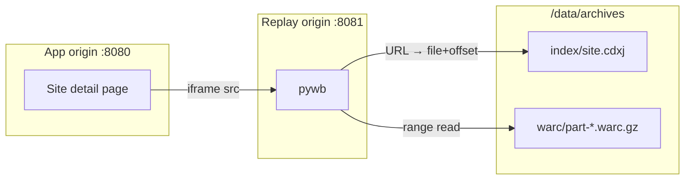

# 07 — Replay: Viewing Archives in the UI

Covers R11. The requirement — browse a complete archived site inside the web UI — is the one ArchiveBox structurally couldn't meet (its issue 6), because per-URL snapshots have no notion of a site.

The answer the original notes reached is the right one: **index across many WARCs, don't merge them** ([D2](00-decisions.md#d2--index-across-warcs-never-merge-or-concatenate-them)). Same model the Wayback Machine uses internally.

---

## Architecture



pywb is a separate s6 service, read-only against the archive tree, with no database access. It reads a generated `/config/pywb/config.yaml` and is reloaded when collections change.

The two origins are a **security boundary**, not a deployment detail — see [below](#replay-is-untrusted-code-execution).

---

## Indexing

After each capture, the `cdxj-index` post-processor rebuilds the site's index across **all** of its WARCs:

```bash
cdxj-indexer --sort \
  /data/archives/Blogs/Photography/example-blog/captures/*/warc/*.warc.gz \
  > /data/archives/Blogs/Photography/example-blog/index/site.cdxj.tmp
mv site.cdxj.tmp site.cdxj      # atomic; replay never sees a partial index
```

A CDXJ line maps a URL to bytes:

```
com,blogspot,example)/2019/04/post.html 20260809142612 {"url": "https://example.blogspot.com/2019/04/post.html", "mime": "text/html", "status": "200", "digest": "XQ3…", "length": "48213", "offset": "182304", "filename": "captures/20260809T142530Z-full-wget/warc/part-00000.warc.gz"}
```

The key is a SURT (sort-friendly reversed URL) plus a timestamp, which is what makes "all captures of this URL, chronologically" a range scan rather than a search.

**Rules.**
- The index is always fully rebuilt, never appended. Full rebuilds are fast (a few seconds for tens of thousands of records) and eliminate a whole class of drift bugs.
- Written to a temp file and renamed, as bytes rather than text so the line endings are identical on every platform. A half-written index is a broken site; a rebuild that differs only in newlines makes "did the index change?" unanswerable.
- `filename` is stored **relative to the site directory**, so moving a site between folders doesn't invalidate the index. Get this wrong and every folder move silently breaks replay.

  This one has a trap with teeth. `cdxj-indexer` records `os.path.basename(filename)` unless it is given `dir_root`, and **every capture writes `warc/part-00000.warc.gz`** — so the default makes all of a site's captures index to the same name. The symptom is not a wrong page, it is a **503**, and it cannot appear until the second capture, because the first has nothing to collide with. Measured both ways against pywb 2.9.1: with `dir_root`, two captures of one URL return their own bodies; without it, both return 503. The index builder refuses to write an index whose filenames are not the site-relative paths it passed in.
- The index is derived data — deletable and regenerable from the WARCs at any time. A **Rebuild index** button on every site is a cheap, effective support tool.

Because the index spans every capture, replay naturally gets a **time dimension**: a page captured in five different runs has five versions, browsable via pywb's timeline.

---

## pywb configuration

The config carries global settings only. **Collections are not listed in it** — they are discovered from a tree of symlinks:

```yaml
# /data/replay/config.yaml — GENERATED, do not hand-edit
collections_root: collections
framed_replay: true
enable_cdx_api: true
enable_memento: true
enable_content_security_policy: true
port: 8081
```

```
/data/replay/collections/site-42/
    indexes  ->  /data/archives/Blogs/Photography/example-blog/index
    archive  ->  /data/archives/Blogs/Photography/example-blog
```

This replaced an earlier design that listed `collections:` explicitly, because **pywb picks up a collection created while it is running** — verified against 2.9.1: a collection is a 404 before the symlinks exist and a 200 immediately after, with no restart. Listing them would have meant bouncing the replay service every time a site was added, and giving the app a way to reach into the service supervisor to do it. The directory tree is the whole interface between the two processes instead.

**Collections are keyed by site ID (`site-42`), never by slug or path.** Renaming or moving a site must not change its replay URL — bookmarks and iframe state depend on it. Moving a site re-points one symlink.

`archive` points at the *site* directory, so the relative `filename` values in the CDXJ resolve across every capture.

The tree is derived data: `cairn replay-init` rebuilds it and the config from the database, runs at every boot, and is what repairs a tree after a restore, a folder move, or a recreated volume.

---

## Embedding in the UI

```
/replay/site-42/                          → collection root, latest capture of the seed
/replay/site-42/20260809142612/https://example.blogspot.com/2019/04/post.html
/replay/site-42/*/https://example.blogspot.com/…    → all versions of one URL
```

The site detail page renders:

```
┌─ Example Blog ──────────────────────── [Capture] [Discover] [⋯] ─┐
│ Overview │ Pages (1,847) │ ▸Replay◂ │ Captures (4) │ Feeds │ … │
├───────────────────────────────────────────────────────────────────┤
│ ← → ⟳  https://example.blogspot.com/2019/04/post.html            │
│ Capture: [2026-08-09 14:26 ▾]  4 versions  [Open in new tab] [↗] │
├───────────────────────────────────────────────────────────────────┤
│                                                                   │
│              ( pywb framed replay — iframe )                      │
│                                                                   │
└───────────────────────────────────────────────────────────────────┘
```

The app supplies the chrome — capture selector, URL bar, version count — via pywb's CDX API (`/replay/site-42/cdx?url=…&output=json`). pywb supplies the content. Keeping the chrome outside the iframe means archived CSS can't restyle your controls and archived JS can't fake them.

**Framed replay** (`framed_replay: true`) is required: pywb serves a top frame containing an inner frame with the rewritten content, which keeps navigation inside the archive and gives a stable place to hang the banner.

---

## Replay is untrusted code execution

The single most important security property in this document.

**Archived pages run their JavaScript in your browser.** Any blog you archive — including one that was compromised at capture time — contains scripts that execute during replay. If replay shares an origin with the app, that archived script can read the session cookie, call the API with your credentials, and exfiltrate the entire instance. This is not theoretical; it's the standard threat model for every web archive replay system.

### Required mitigations

| Mitigation | How |
|---|---|
| **Separate origin** | pywb on a different port (`:8081`) — different port alone is a different origin for same-origin policy. A different *hostname* (`replay.example.com`) is better because it also separates cookie scope, which ports do not |
| **No app cookies on the replay origin** | Session cookies set with `Domain` matching only the app host. Never a shared parent domain with `Domain=.example.com` |
| **CSP** | `enable_content_security_policy: true` — pywb injects a policy limiting archived content's outbound reach |
| **Sandboxed iframe** | `sandbox="allow-scripts allow-same-origin allow-forms allow-popups"`. Archived JS needs scripts and same-origin *relative to the replay origin* to function; the sandbox still blocks top-navigation and plugins |
| **`referrerpolicy="no-referrer"`** | Don't leak app URLs into archived content |
| **Live-leak prevention** | pywb rewrites subresource URLs to route through the archive, so replay doesn't silently fetch from the live internet. Verify this in testing — a page that loads live analytics during replay is both a privacy leak and a correctness bug |

### The cookie-scope trap

Ports do not isolate cookies. `app.example.com:8080` and `app.example.com:8081` share a cookie jar. If you run both on the same hostname with different ports, an archived page **can** read your session cookie.

**Therefore:** if the instance is exposed to the internet, replay must be on a distinct hostname. The reverse-proxy examples in [10](10-deployment-unraid.md) do this, and the app should detect the same-host case at startup and log a prominent warning — this is the kind of misconfiguration that looks fine forever until it doesn't.

---

## Raw record inspection

Alongside rendered replay, a records view for debugging and verification:

```
┌─ Record ──────────────────────────────────────────────────────────┐
│ URL     https://example.blogspot.com/2019/04/post.html            │
│ Captured 2026-08-09 14:26:12 UTC   Status 200   48.2 KB           │
│ Type    text/html; charset=UTF-8                                  │
│ Digest  sha1:XQ3RN7…                                              │
│ WARC    captures/20260809T142530Z-full-wget/warc/part-00000.warc.gz│
│         offset 182304, length 48213                               │
│                                                                   │
│ [Response headers] [Request headers] [Raw payload] [Download]     │
└───────────────────────────────────────────────────────────────────┘
```

Served by the app (not pywb) via `warcio`, reading the byte range directly. Raw payloads download as attachments with `Content-Disposition: attachment` and `Content-Type: application/octet-stream` — never rendered inline on the app origin, which would reintroduce exactly the XSS the origin separation prevents.

---

## WACZ export

[WACZ](https://specs.webrecorder.net/wacz/latest/) packages WARCs + index + metadata into one ZIP. Two things it buys you:

**Portability.** One file containing a complete site archive, openable in [ReplayWeb.page](https://replayweb.page/) with no server at all. Sharing an archive becomes sending a file.

**Serverless replay.** The `<replay-web-page>` custom element replays a WACZ entirely client-side via a service worker. Worth considering as a *second* replay path: it needs no pywb process, and it runs archived content inside the service worker's scope rather than a server origin.

```bash
wacz create -o exports/example-blog-2026-08.wacz \
  -t --detect-pages \
  captures/*/warc/*.warc.gz
```

pywb also serves WACZ directly, so an exported file stays replayable in place.

**Recommendation:** ship pywb as the primary replay path (better for large, incrementally-growing archives — no repackaging on every capture) and WACZ export as an on-demand feature for sharing, offsite backup, and long-term portability. Revisit client-side replay as the primary path if pywb's operational cost turns out to be higher than expected.

---

## Performance notes

- **Index size** ~200–400 bytes per record. A 100k-URL site is a 20–40 MB CDXJ — memory-mapped by pywb, fine.
- **Keep indexes on the cache pool**, not the array. pywb does binary search over the CDXJ; every replay request is several random reads, and spinning disks make that visibly slow.
- **Range reads into `.warc.gz`** are cheap because each record is an independently-gzipped member — that's precisely why the format allows offset-based access.
- **First replay after a large capture** is slower while the OS page cache warms. Not worth optimizing.
- **Many collections** (hundreds of sites) make pywb's config large but not slow; it loads collections lazily.

---

## Failure modes

| Symptom | Cause | Fix |
|---|---|---|
| Blank iframe, 404 in pywb | Index missing or `filename` paths wrong | Rebuild index; check paths are site-relative |
| Page renders unstyled | CSS host wasn't in scope | Re-check the domain picker; recapture with the asset host enabled |
| Images missing | Lazy-loaded (`data-src`) and wget didn't see them | Known wget limitation ([05](05-capture-engines.md#known-wget-limitations-to-document-in-the-ui)); recapture with a browser engine |
| Replay shows the content warning | Cookies expired or didn't cover the host | Re-mint the profile, recapture ([06](06-access-profiles.md)) |
| Links leave the archive | Rewriting missed a URL form (JS-constructed, usually) | Expected with non-browser capture; the banner should make "you left the archive" obvious |
| pywb won't start | Generated config invalid — usually a path with unescaped characters | Validate generated YAML before writing; keep the previous config as `.bak` and fall back |
| pywb won't start, `ModuleNotFoundError: pkg_resources` | pywb 2.9.1 still imports it; setuptools removed it in 81 | The image pins `setuptools<81`. Nothing else in the container notices, so the only symptom is that replay is silently absent |
| Replay tab blank, CSP violation in the console | `frame-src` did not match the iframe's origin | Both come from `Settings.replay_origin_for`; if they ever diverge this is what it looks like |
| 503 on one capture but not another | Index filenames are basenames, not site-relative | Rebuild the index — and see the `dir_root` note under Indexing |
