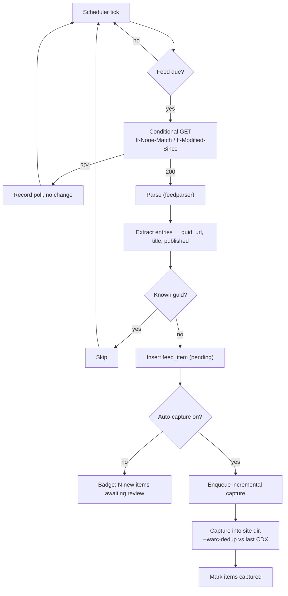

# 08 — Feeds & Scheduling

Covers R12: associate RSS/Atom feeds with a site so new posts land in that site's folder automatically.

> **Built in M6.** Six things below turned out to be wrong when it was run, and each is corrected in place with the measurement that settled it. The three worth knowing before reading the rest:
>
> - **The scheduler is not APScheduler.** See [The scheduler](#the-scheduler).
> - **The first poll of a feed is a baseline, not a backlog.** See [Deduplication](#deduplication).
> - **`--warc-dedup` writes no CDX line for a URL it deduplicated**, so the dedup source cannot be the previous capture's CDX. See [Incremental captures](#incremental-captures).

---

## Learning from the ArchiveBox experience

Its issue 3 was that the feed parser is an older regex-based one built around RSS 2.0's `<link>text</link>` form, and it can't read Atom's `<link href="...">` — which is Blogger's default output. The documented workarounds were forcing `&alt=rss` or falling back to a generic URL-regex parser.

**Use `feedparser`.** It handles RSS 0.90/0.91/0.92/1.0/2.0, Atom 0.3/1.0, CDF, and JSON Feed, plus a great deal of malformed real-world XML, and it normalizes everything into one structure. This turns the whole class of problem into a non-issue rather than a workaround. `&alt=rss` remains available as a per-feed override for the rare broken feed, but it should never be necessary.

The second lesson from those notes is subtler: they concluded it was more dependable to extract URLs with `curl | grep` on a cron than to trust the tool's scheduler. That's a statement about *observability* — the cron pipeline was trusted because you could see what it produced. So: every feed poll records what it fetched, what it parsed, what was new, and what it did, all visible in the UI. A scheduler you can't inspect is a scheduler you won't trust.

---

## Feed model

A site has zero or more feeds. Each has its own interval and state.

```yaml
feeds:
  - url: https://example.blogspot.com/feeds/posts/default
    kind: auto              # auto | rss | atom | sitemap | json
    interval_min: 360
    enabled: true
```

### Auto-discovery

When a feed is added by URL, or during discovery, the tool finds feeds automatically from:

- `<link rel="alternate" type="application/rss+xml|application/atom+xml|application/json">`
- Platform conventions by fingerprint — Blogger: `/feeds/posts/default`, `/feeds/posts/default?alt=rss`, `/feeds/comments/default`; WordPress: `/feed`, `/comments/feed`; Ghost/Hugo/Jekyll: `/rss`, `/index.xml`, `/atom.xml`
- Sitemap URLs from `robots.txt`, offered as `kind: sitemap` watchers

Discovered feeds are presented as a checklist, not added silently. Comment feeds in particular are usually noise and shouldn't be enabled by default.

> **Corrected in part.** *Find feeds* in the add dialog is the checklist: it probes live, shows what each candidate contains, and saves nothing. But a discovery run still attaches what it finds, with the comment feed switched **off** and the posts feed **on**. The doc is right about comment feeds — hundreds of entries pointing at fragments of pages the posts feed already covers, which after M6 means real requests and real captures — and wrong about the posts feed, which is the reason the site is being archived. Making somebody tick a box to get the obvious thing is friction, not consent. Either way the list is the same and visible; the difference is only what happens if nobody looks at it.
>
> Sitemaps are *offered* rather than attached, as specified. A sitemap watcher is a different bargain — completeness rather than latency — and it is the only thing that can tell you a page disappeared.

---

## The polling cycle



### Conditional GET

Always send `If-None-Match` (stored ETag) and `If-Modified-Since` (stored `Last-Modified`). A 304 costs almost nothing, which is what makes short intervals reasonable. Blogger honors both.

### Deduplication

**The first successful poll of a feed is a baseline, not a backlog.** Every entry in a feed is new the first time it is read, so treating them as new content means adding a watch to a blog and immediately re-fetching its entire archive one post at a time — the most expensive possible way to obtain what a single full capture already covers, and the default behaviour on a 500-post Blogger feed. A first poll records everything it sees as already known and captures none of it; the watch means "new" from that moment onward. The poll history says `baseline: N existing` so it is visible rather than mysterious.

Primary key is the entry's GUID (`<guid>` / `<id>`). Fall back to canonicalized URL when the GUID is absent or unstable — some platforms regenerate GUIDs on every edit, which would otherwise re-capture the entire feed on every poll.

URL canonicalization before comparison: lowercase scheme and host, strip default ports, strip a trailing `/` on non-root paths, drop tracking params (`utm_*`, `fbclid`, `gclid`), and drop Blogger's `m=1`. Store both the raw and canonical URL — canonical for dedup, raw for capture.

**Updated posts.** A post edited after publication keeps its GUID and won't be re-captured. Offer per-feed `recapture_on_update: true`, which compares the entry's `updated` timestamp against `first_seen_at` and re-captures on change. Default off — most feeds touch `updated` for trivial reasons and it turns into constant churn.

### Backoff

`consecutive_failures` drives exponential backoff (×2 per failure, capped at 24 h) so a dead feed doesn't poll every ten minutes forever. After 10 consecutive failures the feed is disabled with a notification. Any success resets the counter.

---

## Incremental captures

A feed-triggered capture is a normal capture with a different seed set and a smaller footprint:

```json
{
  "kind": "feed",
  "seeds": ["https://example.blogspot.com/2026/08/new-post.html"],
  "scope": { "…": "the site's existing scope, unchanged" },
  "incremental": {
    "dedup_cdx": "…/captures/20260809T142530Z-full-wget/wget.cdx"
  },
  "config": {"max_depth": 1}
}
```

Three properties that make this work well:

**Same directory.** It lands in the site's `captures/` alongside the full capture, gets folded into the same `index/site.cdxj`, and appears in the same replay collection. There's no separate "incremental archive" concept — that's the whole point of R12's "included in the folder for that site."

**Dedup against every prior CDX, not the prior one.** `--warc-dedup` means the site template, CSS, JS, and previously-seen images produce `revisit` records instead of duplicate payloads, so a new post costs 100–500 KB rather than re-storing the theme.

> **Corrected: "the prior CDX" would break the chain after one capture.** wget writes **nothing** to `--warc-cdx` for a URL it deduplicated. Measured against wget 1.25.0: a second crawl of a four-page site produced four `revisit` records in the WARC and a CDX file containing only its header line. So a capture whose payloads were all unchanged leaves an empty `part.cdx`, the next capture deduplicates against nothing, and the saving alternates on and off forever with nothing in the log to say so. The dedup file handed to wget is now the union of every prior capture's CDX, keyed on URL plus payload digest, written into the job's temp directory.
>
> The same finding has a second consequence, in the opposite direction: an incremental capture's `url_count` and URL list are built from that CDX, so a capture that deduplicated perfectly reported **zero URLs** while its WARC was full — which reads as "the capture did nothing" precisely when it did the best possible thing. The engine now reconciles the CDX against wget's own crawl log at the end of the run and emits the difference as `revisit` URL events.

**Depth 1, page requisites on.** Capture the post and everything it needs to render, but don't re-crawl the whole site because the new post links to the archive index.

> `--level=1` reads ambiguously, so it was measured: given a seed linking to an index which links to an old post, wget 1.25.0 fetches the seed, its requisites, and the index — and stops. Not the seed alone, and not the archive behind the index. The number matches the intent.
>
> The seed set matters as much as the depth. A capture's seeds normally include every URL discovery found, which is what makes a *full* capture complete; handing that to an incremental run turns "archive this new post" back into "archive the site" regardless of depth. A feed capture is seeded with its own items and nothing else — not even the site's seed URL.

**`config.max_depth` is not where depth lives.** The example above shows it under `config`, but the engine's config schema declares `additionalProperties: false` and knows nothing about depth; `max_depth` is a scope field, and the job spec overrides the site's scope for that run.

### Batching

Ten new posts in one poll should be one capture job with ten seeds, not ten jobs. Batch by feed poll, with a cap (default 50 seeds) that splits into multiple jobs beyond it.

---

## Beyond feeds: two watchers worth having

Feeds are the requirement, but they systematically miss things. Both of these reuse the same machinery.

### Sitemap diff watcher

`kind: sitemap`. Fetch the sitemap (and its pagination), diff the URL set against the last poll, and treat additions as new items.

**Why it matters.** Feeds are usually capped at the most recent 25 posts, and they only carry *posts* — never pages, never archives, never anything the theme adds. A sitemap diff catches everything the feed structurally can't, and `<lastmod>` gives you modification detection for free. For a serious archive, run both: feed for latency, sitemap for completeness.

**Removals are only ever inferred from a sitemap, and only from a complete read of one.** This is the asymmetry that makes the disappearance notification usable rather than constant: an entry falling out of a *feed* is the feed working as designed, so absence there means nothing at all. And a sitemap walk that failed part-way has not seen the site's full URL set, so its absences are its own — a partial read is never diffed, or the first flaky poll announces that the entire archive has vanished.

### Page-change watcher

For sites with neither feed nor sitemap: fetch a page, extract a content hash (after stripping obviously-volatile content — timestamps, view counters, ads), and enqueue a capture when it changes. This is what [changedetection.io](https://changedetection.io/) does; the mechanism is simple enough to build in rather than integrate.

Also useful pointed at a *listing* page — an index that has no feed but reliably links new content.

---

## The scheduler

One asyncio ticker, waking every 60 seconds and asking the database what is due. It only ever *enqueues* jobs into the `jobs` table; the supervisor executes them. That separation means scheduling stays responsive regardless of how backed up capture work is.

> **Corrected: this specified APScheduler with a SQLAlchemy job store, and that is the wrong tool here.** Two reasons, one structural and one measured.
>
> A persistent job store is a *second copy of the schedule*. `feeds` already holds `interval_min`, `enabled` and `next_poll_at`; a job store holds the fire time as well, so every interval change is two writes that can disagree, and the disagreement is invisible until a feed silently stops polling.
>
> And its two failure modes are both defaults. Measured against APScheduler 3.11 with a `SQLAlchemyJobStore` on SQLite, restarting the process after a fire time had passed:
>
> | configuration | what happened |
> |---|---|
> | default `misfire_grace_time=1` | the run is **dropped** — a log line, and nothing else |
> | `misfire_grace_time=None`, `coalesce=False` | the whole backlog fires at once: a 30-second outage of a 3-second job produced **12 simultaneous runs** |
>
> On Unraid the container restarts routinely, so the first means a poll silently skipped and six hours of latency on a six-hour feed. The second, scaled up, is a week of downtime becoming 28 concurrent polls of one feed — exactly what the jitter requirement below exists to prevent. Configured correctly (`misfire_grace_time=None, coalesce=True`) it behaves; it is two non-default settings away from either failure, in a component nobody looks at until it is already wrong.
>
> A due-time query has neither problem by construction. Nothing persists a fire time that could be missed, so a container down for a week comes back and polls each overdue feed exactly once. What it costs is cron expressions, and nothing here needs one: every built-in schedule below is an interval, and quiet hours are a gate on running rather than a time to run at.

Polls are sequential and capped at 20 per tick. Twenty a minute is far more than a single-user instance can want, and doing them one at a time is politeness that needs no coordination — no two requests to one host can overlap because no two requests overlap at all.

### Built-in schedules

| Job | Default | Configurable | Status |
|---|---|---|---|
| Feed polls | per-feed `interval_min` (default 6 h) | per feed | built |
| Sitemap diffs | daily | per watcher | built |
| Full recapture | off | global | built |
| Stats rollup | hourly | global | built |
| Trash purge | daily | global | built |
| Symlink tree refresh | on change | global | already on change and at boot since M4 — a timer would add nothing |
| Discovery refresh | monthly | per site | **not built.** Re-running discovery can change a site's scope, and doing that unattended is a decision, not maintenance |
| Integrity verification | weekly | global | ✅ M8. `integrity.verify_days`, 0 for never. The tick enqueues a `verify` job rather than running it: it reads every archived byte, so it belongs in the same queue as the captures it competes with for the array |
| Retention | daily | global | ✅ M8. Enqueues a `purge` job for sites whose policy is on; the plan is recomputed inside the job, never taken from the request |
| Log rotation | daily | global | not built, and should not be: logs go to stdout for s6 and Docker to handle |

**Full recapture is global rather than per site**, which is a simplification of what this table asked for. Per-site would need a column on `sites` and a control on every site page for something almost nobody turns on; when somebody wants exactly one site refreshed, the Capture button already does it.

**Full recapture defaults to off, deliberately.** It's the setting most likely to be enabled thoughtlessly and then quietly consume terabytes. When a user enables it, show the estimate: *"Full recapture monthly ≈ 3.2 GB/run ≈ 38 GB/year. Incremental feed capture covers new posts at ~2% of this cost. Enable full recapture only if you need to detect edits to existing pages."*

### Windows and politeness

Global settings for when scheduled work may run: quiet hours, and a per-host serialization rule that's not negotiable — never two simultaneous jobs against the same host, regardless of concurrency settings. Jitter every scheduled poll by ±10% so twenty feeds on the same interval don't fire in the same second.

> **Corrected: quiet hours default to off, not to "capture only 01:00–07:00".** That default would mean adding a feed, watching a post appear, and seeing nothing happen for eighteen hours with no explanation — and the only thing it would be throttling is an incremental capture of a few hundred kilobytes, because full recapture is off by default too. The window exists and is preloaded with those hours; switching it on is a decision somebody makes about their own bandwidth.
>
> Quiet hours gate **captures**, not polls. A poll is one conditional GET, and its whole value is latency; holding it back would delay the notification without saving anything worth saving. New items simply stay pending, and the first tick inside the window picks them up — deferral is not a loss, and the UI says which it is.
>
> Per-host serialization is enforced in the job supervisor's claim query, not in the scheduler. It is politeness rather than scheduling, so a capture somebody started by hand owes it too — and two simultaneous crawls of one blog is what gets an archiver blocked, whoever started them. A job held back by the rule is skipped rather than blocking, so one busy host cannot stall work on every other site.

---

## UI

**Site → Feeds tab**

```
┌─ Feeds ────────────────────────────────────────────── [+ Add feed] ─┐
│                                                                     │
│ ● Posts (Atom)                                    every 6h    [⋯]  │
│   /feeds/posts/default                                              │
│   Last polled 12 min ago · 304 Not Modified                         │
│   142 items seen · 142 captured · 0 pending                         │
│                                                                     │
│ ● Sitemap watcher                                 daily       [⋯]  │
│   /sitemap.xml                                                      │
│   Last polled 4h ago · 1,847 URLs · 2 new                           │
│   ⚠ 2 items pending capture                    [Capture now]        │
│                                                                     │
│ ○ Comments (Atom)                                 disabled    [⋯]  │
└─────────────────────────────────────────────────────────────────────┘

Auto-capture new items   [ ✓ ]      Batch window  [ 15 min ▾ ]
```

**Add-feed dialog** does a live test fetch before saving: parses, shows the detected format, entry count, the three most recent titles, and whether the URLs fall inside the site's current scope. Adding a feed whose entries are out of scope is a real and confusing failure — catch it at add time.

**Poll history** per feed: timestamp, HTTP status, entries seen, new items, action taken, error if any. This is what makes the scheduler trustworthy in a way ArchiveBox's wasn't.

---

## Notifications

New content in an archive is exactly the kind of thing worth a push. Support ntfy, Apprise, and generic webhooks, with per-event opt-in.

A target is one URL, and its scheme decides the transport: `ntfy://` or an ntfy.sh address goes to ntfy natively, any other `http(s)://` gets a JSON POST — which is what Discord, Slack, Gotify and Home Assistant webhooks already expect — and anything else is handed to Apprise. Apprise is optional at import time like Playwright and pywb: it ships in the image, and a source checkout says so rather than failing at the moment something goes wrong.

**A notification is never allowed to fail the thing that triggered it.** Every send is best-effort and swallows its errors into the log, and none of them run inside the transaction that finished the work. A capture that succeeded must not be reported as failed because a webhook was down.

**The disk-space warning is throttled to once a day.** The condition persists — a full disk stays full — so an unthrottled check pushes once a minute until somebody frees space, which is how a person learns to mute the channel that was going to tell them something important later.

| Event | Default |
|---|---|
| Capture failed | on |
| Feed disabled after repeated failures | on |
| Access profile expiring within 24 h | on |
| Interstitial detected mid-crawl | on |
| Disk space below floor | on |
| Integrity check found a mismatch | on |
| New items captured | off (noisy) |
| Discovery found new hosts | off |
| **Discovery found URLs that disappeared from the site** | on |

That last one is the interesting one — it's the notification that says *"a post you archived no longer exists upstream."* It's the moment the tool paid for itself, and it's also a signal to protect that capture from any retention policy.
