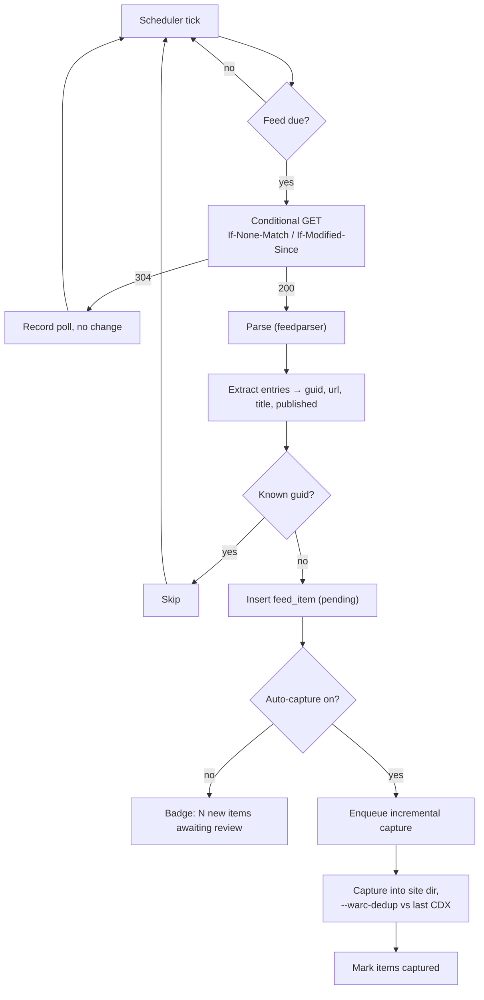

# 08 — Feeds & Scheduling

Covers R12: associate RSS/Atom feeds with a site so new posts land in that site's folder automatically.

---

## Learning from the ArchiveBox experience

Its issue 3 was that the feed parser is an older regex-based one built around RSS 2.0's `<link>text</link>` form, and it can't read Atom's `<link href="...">` — which is Blogger's default output. The documented workarounds were forcing `&alt=rss` or falling back to a generic URL-regex parser.

**Use `feedparser`.** It handles RSS 0.90/0.91/0.92/1.0/2.0, Atom 0.3/1.0, CDF, and JSON Feed, plus a great deal of malformed real-world XML, and it normalizes everything into one structure. This turns the whole class of problem into a non-issue rather than a workaround. `&alt=rss` remains available as a per-feed override for the rare broken feed, but it should never be necessary.

The second lesson from those notes is subtler: they concluded it was more dependable to extract URLs with `curl | grep` on a cron than to trust the tool's scheduler. That's a statement about *observability* — the cron pipeline was trusted because you could see what it produced. So: every feed poll records what it fetched, what it parsed, what was new, and what it did, all visible in the UI. A scheduler you can't inspect is a scheduler you won't trust.

---

## Feed model

A site has zero or more feeds. Each has its own interval and state.

```yaml
feeds:
  - url: https://example.blogspot.com/feeds/posts/default
    kind: auto              # auto | rss | atom | sitemap | json
    interval_min: 360
    enabled: true
```

### Auto-discovery

When a feed is added by URL, or during discovery, the tool finds feeds automatically from:

- `<link rel="alternate" type="application/rss+xml|application/atom+xml|application/json">`
- Platform conventions by fingerprint — Blogger: `/feeds/posts/default`, `/feeds/posts/default?alt=rss`, `/feeds/comments/default`; WordPress: `/feed`, `/comments/feed`; Ghost/Hugo/Jekyll: `/rss`, `/index.xml`, `/atom.xml`
- Sitemap URLs from `robots.txt`, offered as `kind: sitemap` watchers

Discovered feeds are presented as a checklist, not added silently. Comment feeds in particular are usually noise and shouldn't be enabled by default.

---

## The polling cycle



### Conditional GET

Always send `If-None-Match` (stored ETag) and `If-Modified-Since` (stored `Last-Modified`). A 304 costs almost nothing, which is what makes short intervals reasonable. Blogger honors both.

### Deduplication

Primary key is the entry's GUID (`<guid>` / `<id>`). Fall back to canonicalized URL when the GUID is absent or unstable — some platforms regenerate GUIDs on every edit, which would otherwise re-capture the entire feed on every poll.

URL canonicalization before comparison: lowercase scheme and host, strip default ports, strip a trailing `/` on non-root paths, drop tracking params (`utm_*`, `fbclid`, `gclid`), and drop Blogger's `m=1`. Store both the raw and canonical URL — canonical for dedup, raw for capture.

**Updated posts.** A post edited after publication keeps its GUID and won't be re-captured. Offer per-feed `recapture_on_update: true`, which compares the entry's `updated` timestamp against `first_seen_at` and re-captures on change. Default off — most feeds touch `updated` for trivial reasons and it turns into constant churn.

### Backoff

`consecutive_failures` drives exponential backoff (×2 per failure, capped at 24 h) so a dead feed doesn't poll every ten minutes forever. After 10 consecutive failures the feed is disabled with a notification. Any success resets the counter.

---

## Incremental captures

A feed-triggered capture is a normal capture with a different seed set and a smaller footprint:

```json
{
  "kind": "feed",
  "seeds": ["https://example.blogspot.com/2026/08/new-post.html"],
  "scope": { "…": "the site's existing scope, unchanged" },
  "incremental": {
    "dedup_cdx": "…/captures/20260809T142530Z-full-wget/wget.cdx"
  },
  "config": {"max_depth": 1}
}
```

Three properties that make this work well:

**Same directory.** It lands in the site's `captures/` alongside the full capture, gets folded into the same `index/site.cdxj`, and appears in the same replay collection. There's no separate "incremental archive" concept — that's the whole point of R12's "included in the folder for that site."

**Dedup against the prior CDX.** `--warc-dedup` means the site template, CSS, JS, and previously-seen images produce `revisit` records instead of duplicate payloads. A new post typically costs 100–500 KB rather than re-storing the theme.

**Depth 1, page requisites on.** Capture the post and everything it needs to render, but don't re-crawl the whole site because the new post links to the archive index.

### Batching

Ten new posts in one poll should be one capture job with ten seeds, not ten jobs. Batch by feed poll, with a cap (default 50 seeds) that splits into multiple jobs beyond it.

---

## Beyond feeds: two watchers worth having

Feeds are the requirement, but they systematically miss things. Both of these reuse the same machinery.

### Sitemap diff watcher

`kind: sitemap`. Fetch the sitemap (and its pagination), diff the URL set against the last poll, and treat additions as new items.

**Why it matters.** Feeds are usually capped at the most recent 25 posts, and they only carry *posts* — never pages, never archives, never anything the theme adds. A sitemap diff catches everything the feed structurally can't, and `<lastmod>` gives you modification detection for free. For a serious archive, run both: feed for latency, sitemap for completeness.

### Page-change watcher

For sites with neither feed nor sitemap: fetch a page, extract a content hash (after stripping obviously-volatile content — timestamps, view counters, ads), and enqueue a capture when it changes. This is what [changedetection.io](https://changedetection.io/) does; the mechanism is simple enough to build in rather than integrate.

Also useful pointed at a *listing* page — an index that has no feed but reliably links new content.

---

## The scheduler

APScheduler with a SQLAlchemy job store on the same SQLite DB. It only ever *enqueues* jobs into the `jobs` table; the supervisor executes them. That separation means scheduling stays responsive regardless of how backed up capture work is.

### Built-in schedules

| Job | Default | Configurable |
|---|---|---|
| Feed polls | per-feed `interval_min` (default 6 h) | per feed |
| Sitemap diffs | daily | per watcher |
| Full recapture | off | per site |
| Discovery refresh | monthly | per site |
| Symlink tree refresh | on change, debounced 60 s | global |
| Stats rollup | hourly | global |
| Integrity verification | weekly | global |
| Trash purge | daily | global |
| Log rotation | daily | global |

**Full recapture defaults to off, deliberately.** It's the setting most likely to be enabled thoughtlessly and then quietly consume terabytes. When a user enables it, show the estimate: *"Full recapture monthly ≈ 3.2 GB/run ≈ 38 GB/year. Incremental feed capture covers new posts at ~2% of this cost. Enable full recapture only if you need to detect edits to existing pages."*

### Windows and politeness

Global settings for when scheduled work may run: quiet hours (default: capture only 01:00–07:00 local), global concurrency, and a per-host serialization rule that's not negotiable — never two simultaneous jobs against the same host, regardless of concurrency settings. Jitter every scheduled poll by ±10% so twenty feeds on the same interval don't fire in the same second.

---

## UI

**Site → Feeds tab**

```
┌─ Feeds ────────────────────────────────────────────── [+ Add feed] ─┐
│                                                                     │
│ ● Posts (Atom)                                    every 6h    [⋯]  │
│   /feeds/posts/default                                              │
│   Last polled 12 min ago · 304 Not Modified                         │
│   142 items seen · 142 captured · 0 pending                         │
│                                                                     │
│ ● Sitemap watcher                                 daily       [⋯]  │
│   /sitemap.xml                                                      │
│   Last polled 4h ago · 1,847 URLs · 2 new                           │
│   ⚠ 2 items pending capture                    [Capture now]        │
│                                                                     │
│ ○ Comments (Atom)                                 disabled    [⋯]  │
└─────────────────────────────────────────────────────────────────────┘

Auto-capture new items   [ ✓ ]      Batch window  [ 15 min ▾ ]
```

**Add-feed dialog** does a live test fetch before saving: parses, shows the detected format, entry count, the three most recent titles, and whether the URLs fall inside the site's current scope. Adding a feed whose entries are out of scope is a real and confusing failure — catch it at add time.

**Poll history** per feed: timestamp, HTTP status, entries seen, new items, action taken, error if any. This is what makes the scheduler trustworthy in a way ArchiveBox's wasn't.

---

## Notifications

New content in an archive is exactly the kind of thing worth a push. Support ntfy, Apprise, and generic webhooks, with per-event opt-in:

| Event | Default |
|---|---|
| Capture failed | on |
| Feed disabled after repeated failures | on |
| Access profile expiring within 24 h | on |
| Interstitial detected mid-crawl | on |
| Disk space below floor | on |
| Integrity check found a mismatch | on |
| New items captured | off (noisy) |
| Discovery found new hosts | off |
| **Discovery found URLs that disappeared from the site** | on |

That last one is the interesting one — it's the notification that says *"a post you archived no longer exists upstream."* It's the moment the tool paid for itself, and it's also a signal to protect that capture from any retention policy.
